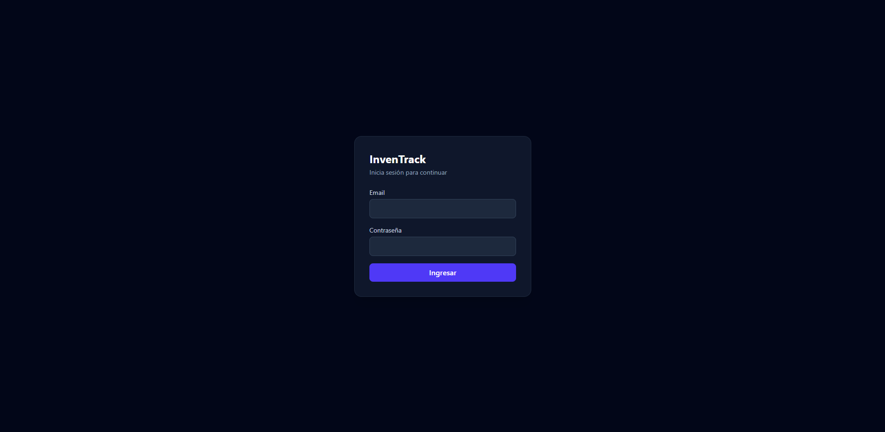
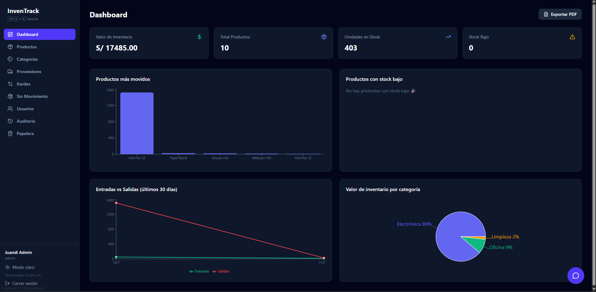
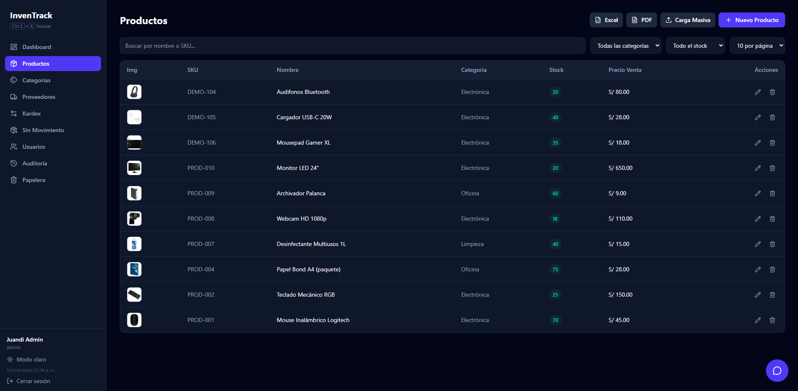
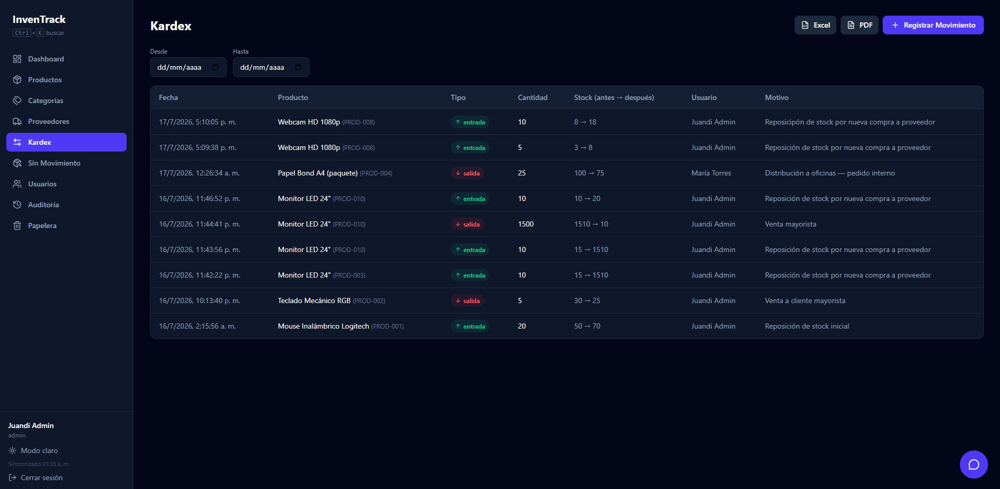
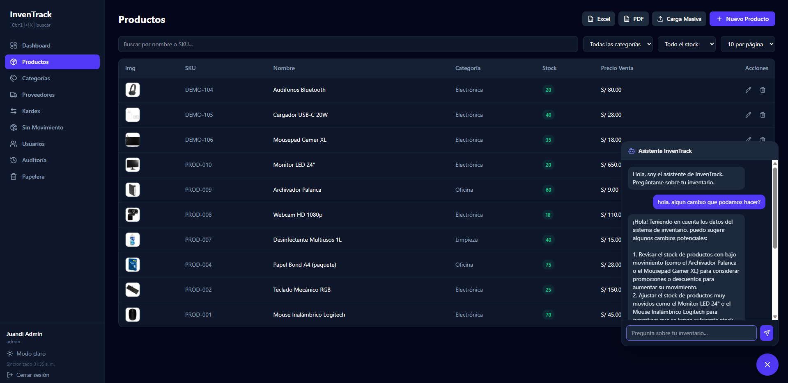

# InvenTrack# 📦 InvenTrack

Sistema de gestión de inventario full stack, construido con **Node.js + Express**, **MySQL** y **React**. Incluye control de stock con kardex transaccional, autenticación con roles, auditoría completa, dashboard con métricas en tiempo real, y un asistente conversacional con IA.

Proyecto de portafolio desarrollado por **Juandi (Juan Diego Constantino Alvarado)** — estudiante de Ingeniería de Sistemas, UPN.

---

## 🖼️ Capturas

**Login**


**Dashboard**


**Gestión de Productos**


**Kardex (control de entradas/salidas)**


**Asistente con IA**


---

## ⚙️ Stack Tecnológico

**Backend**
- Node.js + Express
- MySQL (mysql2)
- JWT para autenticación
- bcryptjs para hash de contraseñas
- Multer para subida de archivos/imágenes
- Groq SDK (IA conversacional gratuita)
- Jest para testing

**Frontend**
- React 19 + Vite
- Tailwind CSS 4
- React Router
- Recharts (gráficos)
- react-hot-toast (notificaciones)
- jsPDF + xlsx (exportables)
- html-to-image (captura de dashboard a PDF)

**Infraestructura**
- Docker + Docker Compose
- Nginx (servidor del frontend en producción)

---

## ✨ Funcionalidades

### Núcleo
- **Autenticación JWT** con roles (`admin` / `almacenero`) y permisos diferenciados
- **CRUD completo** de Productos, Categorías, Proveedores y Usuarios
- **Kardex transaccional**: registro de entradas/salidas con actualización atómica de stock (transacciones SQL)
- **Dashboard en tiempo real**: valor de inventario, productos más movidos, stock bajo, tendencia de entradas vs salidas, valor por categoría
- **Alertas de stock bajo** con badge dinámico en el sidebar (actualización cada 30s)

### Seguridad
- Contraseñas hasheadas con bcrypt
- Rate limiting en login (máx. 3 intentos / 5 min) contra fuerza bruta
- Verificación de sesión activa cada 5s (expulsa automáticamente a usuarios desactivados)
- Bloqueo de login para cuentas desactivadas
- Validación de contraseña fuerte (mínimo 8 caracteres)

### Trazabilidad
- **Auditoría completa**: quién hizo qué y cuándo, en Productos, Categorías, Proveedores y Usuarios — con filtros y búsqueda
- **Historial de precios** por producto (registro automático de cada cambio de precio de compra/venta)
- **Papelera de productos** con función de restaurar (soft delete)
- Bloqueo de eliminación de categorías/proveedores con productos asociados (integridad referencial)

### Productividad
- **Asistente con IA (Groq/Llama 3.3)**: responde preguntas en lenguaje natural sobre el inventario en tiempo real
- **Carga masiva de productos** vía Excel/CSV (con asignación automática de categoría/proveedor por nombre)
- **Exportación a Excel y PDF** en Productos y Kardex
- **Exportación del Dashboard completo a PDF** (snapshot visual)
- **Búsqueda global (Ctrl+K)** de páginas y productos
- **Carga de datos demo** con un click (para pruebas rápidas)
- Vista de **"productos sin movimiento"** (detecta inventario inactivo)
- Subida de imágenes de producto (archivo local o URL externa)
- SKU autogenerado con validación de duplicados

### UX
- Modo claro/oscuro
- Diseño responsive (sidebar colapsable en mobile)
- Loading skeletons, animaciones de entrada, paginación configurable
- Confirmaciones de eliminación con modales personalizados
- Notificaciones toast en todas las acciones

---

## 🚀 Cómo correrlo

### Opción A — Con Docker (recomendado)

Requiere [Docker Desktop](https://www.docker.com/products/docker-desktop/) instalado y corriendo.

```bash
git clone https://github.com/Juandi1602/InvenTrack.git
cd InvenTrack
cp .env.example .env   # completa tus variables (ver más abajo)
docker-compose up --build
```

Esto levanta 3 contenedores: MySQL (con el schema ya creado), backend (puerto 4000) y frontend (puerto 5173).

Abre **http://localhost:5173**

### Opción B — Manual (sin Docker)

**Backend:**
```bash
cd backend
npm install
cp .env.example .env   # completa tus variables
npm run dev
```

**Frontend** (en otra terminal):
```bash
cd frontend
npm install
npm run dev
```

Necesitas MySQL corriendo localmente y crear la base de datos `inventrack` con el schema (ver `mysql-init/init.sql`).

---

## 🔑 Variables de entorno

Copia `backend/.env.example` a `backend/.env` (o el `.env.example` de la raíz si usas Docker) y completa:

```
PORT=4000
DB_HOST=localhost
DB_USER=root
DB_PASSWORD=tu_password
DB_NAME=inventrack
JWT_SECRET=un_secreto_largo_y_aleatorio
GROQ_API_KEY=tu_api_key_de_groq
```

La API key de Groq es gratuita — consíguela en [console.groq.com/keys](https://console.groq.com/keys).

---

## 👤 Primer usuario

La base de datos empieza vacía. Crea tu primer usuario admin con una petición POST:

```
POST http://localhost:4000/api/auth/register
Content-Type: application/json

{
  "nombre": "Admin",
  "email": "admin@inventrack.com",
  "password": "tu_password_segura",
  "rol": "admin"
}
```

Luego inicia sesión desde la interfaz. Una vez dentro como admin, puedes usar el botón **"Cargar datos demo"** en el Dashboard para poblar el sistema con datos de ejemplo.

---

## 🗂️ Estructura del proyecto

```
InvenTrack/
├── backend/
│   ├── src/
│   │   ├── config/         # Conexión a MySQL
│   │   ├── controllers/    # Lógica de negocio
│   │   ├── models/         # Acceso a datos
│   │   ├── routes/         # Endpoints de la API
│   │   ├── middlewares/    # Auth, roles, rate limiting, uploads
│   │   └── __tests__/      # Tests con Jest
│   └── Dockerfile
├── frontend/
│   ├── src/
│   │   ├── pages/          # Vistas principales
│   │   ├── components/     # Componentes reutilizables
│   │   ├── layouts/        # Layout con sidebar
│   │   ├── context/        # Auth y Theme context
│   │   └── utils/          # Exportación a Excel/PDF
│   └── Dockerfile
├── mysql-init/
│   └── init.sql            # Schema inicial (auto-ejecutado por Docker)
└── docker-compose.yml
```

---

## 🧪 Tests

```bash
cd backend
npm test
```

Cubre la lógica crítica de transacciones de stock (entradas, salidas, validación de stock insuficiente).

---
